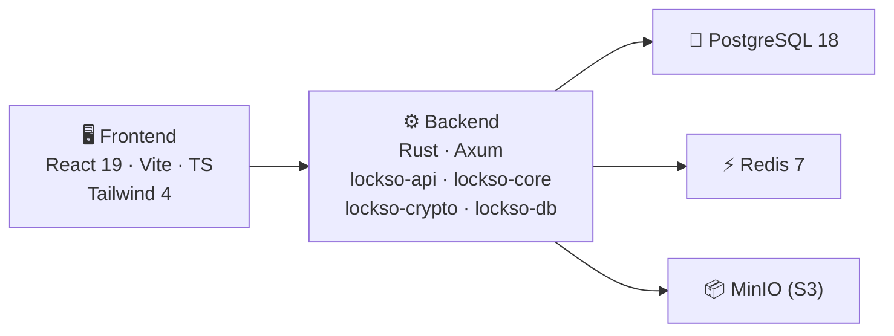

<p align="center">
  
</p>

<h1 align="center">Lockso</h1>

<p align="center">
  Self-hosted password manager for teams and individuals.<br/>
  Built with Rust + React. End-to-end encrypted. Fully open source.
</p>

<p align="center">

[](https://github.com/veloxico/lockso/releases/tag/v0.0.1)
[)](https://hub.docker.com/r/veloxico/lockso-be)
[)](https://hub.docker.com/r/veloxico/lockso-fe)
[](LICENSE)
[](https://github.com/sponsors/veloxico)
[](https://ko-fi.com/alexkoss)
[](#support-the-project)

</p>

---

## Features

- **Server-side encryption** — AES-256-GCM encryption for all stored credentials
- **Vault management** — Organization, Personal, and Private Shared vault types
- **Team collaboration** — User groups, vault sharing with granular permissions
- **Two-factor authentication** — WebAuthn / FIDO2 support
- **Activity audit logs** — Full audit trail with filtering and pagination
- **File attachments** — S3-compatible object storage (MinIO, AWS S3)
- **Trash & recovery** — Soft-delete with restore capability
- **Secure Send** — Time-limited secret sharing with view limits
- **Webhook integrations** — Notify external services on events
- **API keys** — Programmatic access for automation
- **Email notifications** — SMTP, SendGrid, SES, Resend, Mailgun, Postmark, Mandrill
- **Brute-force protection** — Configurable login rate limiting via Redis
- **Password expiration policies** — Enforce rotation schedules
- **Import / Export** — Migrate from other password managers
- **Internationalization** — English and Russian (i18next)
- **Dark theme** — Modern UI built with Tailwind CSS and shadcn/ui
- **Docker-ready** — Multi-arch production images (amd64/arm64)

## Architecture



| Layer | Technology |
|-------|-----------|
| **Frontend** | React 19, TypeScript 5.8, Vite 6, Tailwind CSS 4, Zustand, React Router 7 |
| **Backend** | Rust 1.94, Axum, SQLx, Tokio, Tower |
| **Database** | PostgreSQL 18 |
| **Cache / Sessions** | Redis 7 |
| **Object Storage** | S3-compatible (MinIO / AWS S3) |
| **Crypto** | AES-256-GCM, Argon2id, ChaCha20-Poly1305, ECDSA (ES256) |

## Quick Start (Docker)

### Prerequisites

- [Docker](https://docs.docker.com/get-docker/) 24+
- [Docker Compose](https://docs.docker.com/compose/) v2+

### Development

```bash
# Clone the repository
git clone https://github.com/veloxico/lockso.git
cd lockso

# Create environment file
cp .env.example .env

# Start all services
docker compose up -d

# The app is now running:
#   Frontend:  http://localhost:5173
#   Backend:   http://localhost:8080
#   MinIO UI:  http://localhost:9001
```

The development setup includes hot-reload for both backend (cargo-watch) and frontend (Vite HMR).

### Production

```bash
# Generate a secure encryption key
export LOCKSO_ENCRYPTION_KEY=$(openssl rand -hex 32)

# Start with production compose
docker compose -f docker-compose.prod.yml up -d

# The app is now running:
#   http://localhost:8080 (nginx serves frontend + proxies API)
```

> **Important:** In production, always set `LOCKSO_ENCRYPTION_KEY` to a random 64-character hex string. This key encrypts all stored credentials. Back it up securely — losing it means losing access to all encrypted data.

## Configuration

All configuration is done via environment variables. See [`.env.example`](.env.example) for the full list.

| Variable | Required | Default | Description |
|----------|----------|---------|-------------|
| `DATABASE_URL` | Yes | — | PostgreSQL connection string |
| `REDIS_URL` | Yes | — | Redis connection string |
| `LOCKSO_ENCRYPTION_KEY` | Prod | — | 64 hex chars (32 bytes) for AES-256-GCM |
| `S3_ENDPOINT` | Yes | — | S3-compatible endpoint URL |
| `S3_ACCESS_KEY` | Yes | — | S3 access key |
| `S3_SECRET_KEY` | Yes | — | S3 secret key |
| `S3_BUCKET` | Yes | `lockso-files` | S3 bucket name |
| `SESSION_SECRET` | No | auto | Session signing secret |
| `SESSION_TTL_HOURS` | No | `24` | Session lifetime |
| `LOCKSO_BIND` | No | `0.0.0.0:8080` | Backend bind address |
| `LOCKSO_ENV` | No | `development` | `development` or `production` |

## Database Migrations

Migrations run automatically on backend startup. They are located in `migrations/schema/` and applied in order.

## Project Structure

```
lockso/
├── backend/
│   └── crates/
│       ├── lockso-api/       # HTTP API server (Axum)
│       ├── lockso-core/      # Business logic & services
│       ├── lockso-crypto/    # Cryptographic primitives
│       └── lockso-db/        # Database layer (SQLx)
├── frontend/
│   └── src/
│       ├── api/              # API client modules
│       ├── components/       # React components
│       ├── i18n/             # Translations (en, ru)
│       ├── pages/            # Route pages
│       └── stores/           # Zustand state stores
├── migrations/
│   └── schema/               # SQL migrations (001–016)
├── docker/                   # Docker configs (nginx, etc.)
├── docker-compose.yml        # Development environment
├── docker-compose.prod.yml   # Production environment
├── Dockerfile.be             # Backend production image
├── Dockerfile.fe             # Frontend production image
└── .env.example              # Environment template
```

## Security

- All credential fields are encrypted at rest with AES-256-GCM
- Passwords are hashed with Argon2id
- WebAuthn/FIDO2 for two-factor authentication
- Redis-backed brute-force protection with configurable thresholds
- CSRF protection and secure session management
- No telemetry, no external calls, fully self-contained

### Reporting Vulnerabilities

If you discover a security vulnerability, please report it responsibly by emailing the maintainer directly. Do **not** open a public issue.

## Contributing

Contributions are welcome! Please:

1. Fork the repository
2. Create a feature branch (`git checkout -b feature/my-feature`)
3. Commit your changes
4. Push to the branch
5. Open a Pull Request

## Support the Project

If you find Lockso useful, consider supporting its development:

[](https://github.com/sponsors/veloxico)
[](https://ko-fi.com/alexkoss)

| Network | Address |
|---------|---------|
| **BTC** | `bc1qt5zu44m43f2ca07tedwgund0dxhtpcqkl92afz` |
| **ETH** | `0xaAbcc0B714742525BB97d0594bc4d1DD90Ef5601` |
| **USDT (TRC-20)** | `TAhDQw64uCDdCXKLUmfyjAe1comFPVDj99` |
| **USDT (ERC-20)** | `0xaAbcc0B714742525BB97d0594bc4d1DD90Ef5601` |
| **TON** | `UQA5Z9Lasm_Ke61wYLSuXy7wQnrX7Pefd4RNbDyzBWY9VFjj` |

## License

AGPL-3.0 — see [LICENSE](LICENSE) for details.

© 2025-2026 Aleks Koss / Veloxico
